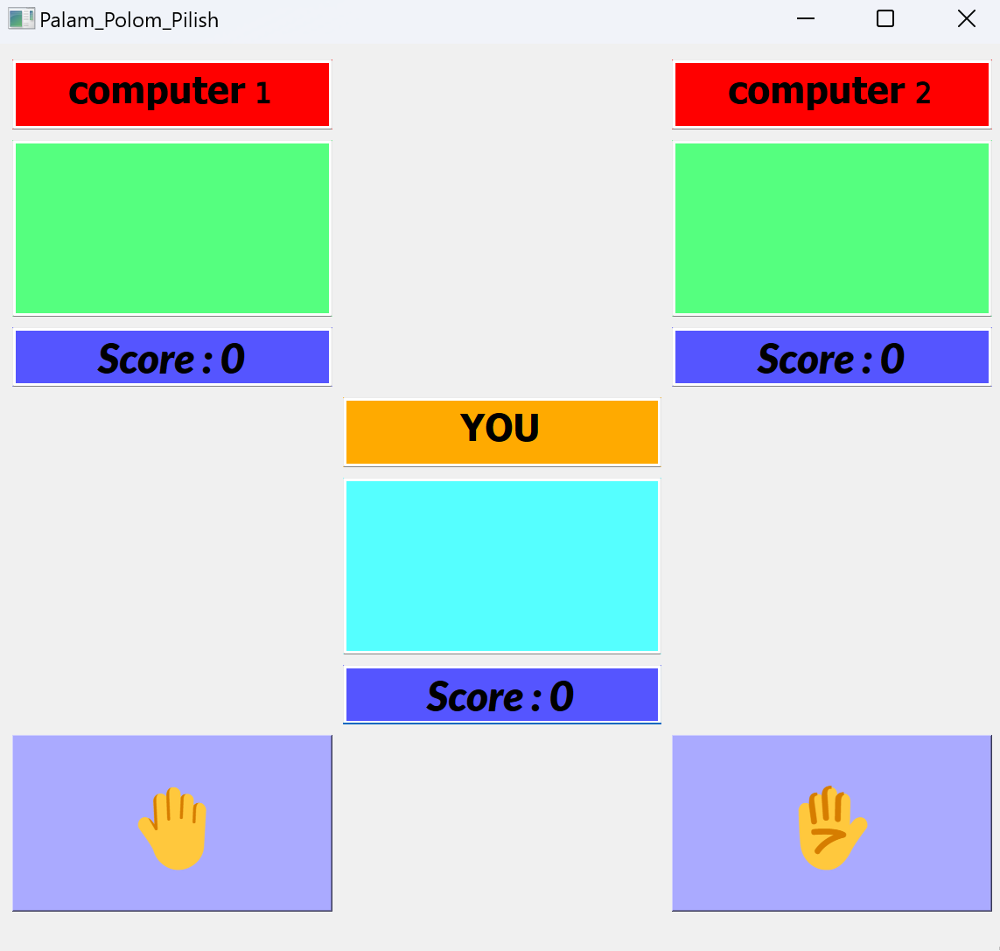

># Assignment_20

## Files Description

| File name | Description |
|--- | --- |
|Palam Polom Pilish.py | In this game, which is played with more than 3 people, the players choose the winner by showing the position of their hand |
|marriage.py | Random marriage between girls and boys, following the law of monogamy  |
|Symmetric_Array.py | Determines whether an array of numbers is symmetric or not |
|Digikala_store_Query_sqlite| Designing a very simple database  |


># Palam_Polom_Pilish

## Overview

In palam_pulum_pilish I write a code for a game.
In this game you must choose 1 or 2 in each round. you play with two computer players.
you must play 5 round and if you can get more score at the end, you win.


## How to Run
execute this command in terminal:

```
python palam_polom_pilish.py
```


# Output:



># Marriage

## Overview

In Married.py I write a code to chose random items from two array and put them beside each other in a new list.
lenght of new list is equal to the lenght of an array that has smaller lenght.

## Zip two lists randomly

---
inputs:

boys = [mohammad, sobhan, ...]
girls = [mahtab, hane, harir, ...]

output:

results = [(sajjad, soghra), (abdollah, minoo) , …]

## How to Run
execute this command in terminal:

```
python Marriage.py
```


># Symmetric_Array

## Overview

In Symmetry_text.py I write a code to check an array and see if it is symmetry or not.

## Zip two lists randomly

Normal function detection program with symmetric function.

 list            | out put 
-----------------|---------
 [1, 4, 3, 4, 1] | True    
 [1, 2, 3]       | False   


## How to Run
execute this command in terminal:

```
python Symmetric_Array.py
```

># Digikala_store_Query_sqlite

## Overview

In this practice i made a database using SQLite for a website like digikala and use 4 main operators (Create Read Update Delete) by sql 

create datebase and set query with sql

sql name | description            
---------|------------------------
Insert_Product | add data to database   
Select_available | get data from database 
Delete_foreign_customers | delete data            
Update_20percent  | update data            


## Instructions

In these part I work with SQLite to use four below command:

INSERT
DELETE
UPDATE
SELECT

these four command are related to sql language and used to work with different database.

with INSER we can add a new data to a table in database.
with DELETE we can remove an item from a table in database.
with UPDATE we can edite an item from a table in database.
with SELECT we can show an item or more from a table in database.

## How to Run
there are four .sql file in sql folder that you can see how these commands work.


